# Street Bowl Café ERD

This is the logical ERD for the database package.

```mermaid
erDiagram
    AUTH_USERS ||--o| PROFILES : "has profile"
    ROLES ||--o{ PROFILES : assigned
    ROLES ||--o{ ROLE_PERMISSIONS : grants
    PERMISSIONS ||--o{ ROLE_PERMISSIONS : contains

    PROFILES ||--o{ SHIFTS : works
    DEVICES ||--o{ SHIFTS : opened_on
    SHIFTS ||--o{ SHIFT_CASH_MOVEMENTS : contains

    MENU_CATEGORIES ||--o{ MENU_ITEMS : contains
    MENU_ITEMS ||--o{ MENU_VARIANTS : has
    TAX_RATES ||--o{ MENU_VARIANTS : taxed_by

    MODIFIER_GROUPS ||--o{ MODIFIERS : contains
    MENU_ITEMS ||--o{ MENU_ITEM_MODIFIER_GROUPS : allows
    MODIFIER_GROUPS ||--o{ MENU_ITEM_MODIFIER_GROUPS : assigned

    UNITS_OF_MEASURE ||--o{ INVENTORY_ITEMS : base_unit
    INVENTORY_CATEGORIES ||--o{ INVENTORY_ITEMS : contains
    INVENTORY_ITEMS ||--o{ INVENTORY_LOTS : stocked_as
    INVENTORY_ITEMS ||--o{ STOCK_MOVEMENTS : moves
    INVENTORY_LOTS ||--o{ STOCK_MOVEMENTS : lot_trace

    MENU_VARIANTS ||--o{ VARIANT_RECIPE_COMPONENTS : recipe
    INVENTORY_ITEMS ||--o{ VARIANT_RECIPE_COMPONENTS : consumes
    MODIFIERS ||--o{ MODIFIER_RECIPE_COMPONENTS : recipe
    INVENTORY_ITEMS ||--o{ MODIFIER_RECIPE_COMPONENTS : consumes

    SUPPLIERS ||--o{ SUPPLIER_ITEMS : supplies
    INVENTORY_ITEMS ||--o{ SUPPLIER_ITEMS : sourced_as
    SUPPLIERS ||--o{ PURCHASE_ORDERS : receives
    PURCHASE_ORDERS ||--o{ PURCHASE_ORDER_ITEMS : contains
    PURCHASE_ORDERS ||--o{ GOODS_RECEIPTS : fulfilled_by
    GOODS_RECEIPTS ||--o{ GOODS_RECEIPT_ITEMS : contains
    GOODS_RECEIPT_ITEMS ||--o| INVENTORY_LOTS : creates
    SUPPLIERS ||--o{ SUPPLIER_BILLS : bills
    SUPPLIER_BILLS ||--o{ SUPPLIER_BILL_PAYMENTS : paid_by

    PROFILES ||--o{ ORDERS : creates
    SHIFTS ||--o{ ORDERS : handles
    DEVICES ||--o{ ORDERS : entered_on
    ORDERS ||--o{ ORDER_ITEMS : contains
    MENU_VARIANTS ||--o{ ORDER_ITEMS : sold_as
    ORDER_ITEMS ||--o{ ORDER_ITEM_MODIFIERS : customized_by
    MODIFIERS ||--o{ ORDER_ITEM_MODIFIERS : selected

    DISCOUNT_TYPES ||--o{ ORDER_DISCOUNTS : type
    ORDERS ||--o{ ORDER_DISCOUNTS : receives

    PAYMENT_METHODS ||--o{ PAYMENTS : method
    ORDERS ||--o{ PAYMENTS : settled_by
    REFUNDS ||--o{ PAYMENTS : refund_payment

    ORDERS ||--o{ REFUNDS : refunded_by
    REFUNDS ||--o{ REFUND_ITEMS : contains
    ORDER_ITEMS ||--o{ REFUND_ITEMS : reverses

    ORDERS ||--o{ ORDER_ACTIONS : audited_by
    ORDERS ||--o{ ORDER_STATUS_HISTORY : status_history

    EXPENSE_CATEGORIES ||--o{ EXPENSES : classifies
    PAYMENT_METHODS ||--o{ EXPENSES : paid_with

    INVOICE_SEQUENCES ||--o{ SALES_INVOICES : numbers
    ORDERS ||--o| SALES_INVOICES : documented_by
    SALES_INVOICES ||--o{ CREDIT_NOTES : adjusted_by
    REFUNDS ||--o| CREDIT_NOTES : documented_by
    SALES_INVOICES ||--o{ INVOICE_PRINT_EVENTS : printed

    INVENTORY_ITEMS ||--o{ STOCK_COUNT_ITEMS : counted
    STOCK_COUNTS ||--o{ STOCK_COUNT_ITEMS : contains
```



## Core design choices

### No permanent customer table

The café currently does not need customer CRM/loyalty. Customer name, delivery contact, and similar information are stored only as snapshots on the order where required.

### Menu item vs variant

A `menu_item` represents the product family, while `menu_variant` represents the actual sellable option.

Example:

```text
Iced Latte
  ├─ Small
  ├─ Medium
  └─ Large
```

Every sellable item should have at least one variant. Products without visible variants can use a default variant named `Standard`.

### Recipes

Recipes are attached to variants because different sizes can consume different quantities.

Modifiers can also have recipe components.

Example:

```text
Large Iced Latte
  22 g coffee beans
  240 ml milk

Extra Shot modifier
  9 g coffee beans
```

### Inventory

Every incoming tracked quantity is represented by an inventory lot, even when the item does not expire. Expiration may be null.

Negative consumption uses FEFO where an expiration date exists.

### Purchases vs expenses

Inventory purchases are procurement transactions and eventually become Cost of Goods Sold through inventory consumption.

Operating expenses remain in `expenses`.

This prevents double-counting ingredient purchases as both an immediate expense and COGS.

### Payments

An order can have multiple payment rows. The first UI version can still allow only one method, but the database is ready for split payment.

### Refunds

Refunds are line-level and can therefore be full or partial. Inventory is not automatically restored on refund because prepared food usually cannot return to sellable stock.

### Invoices

`orders` are operational sales records.

`sales_invoices` are fiscal/document records and preserve business/buyer/tax snapshots even if settings change later.
