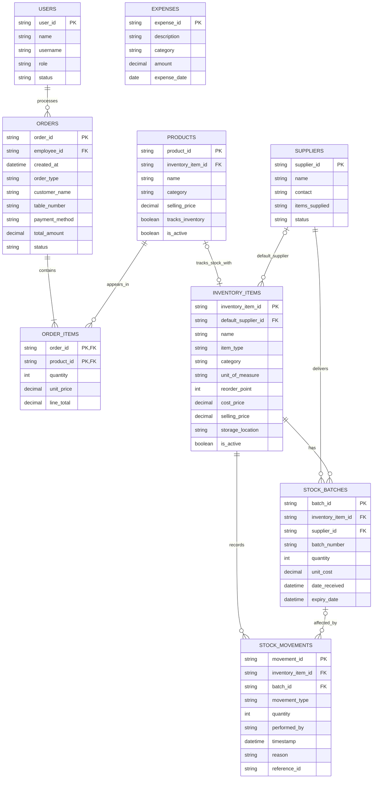

# Street Bowl Café Prototype Database ERD

This ERD describes the **general database structure represented by the demo**.
The Flutter prototype currently stores these records in one shared in-memory
data store, so data resets when the application restarts. The identifiers and
relationships are database-ready, but this is intentionally smaller than the
future production database.

## Single-source data flow

| Demo action | Records written | Modules that immediately use the result |
|---|---|---|
| Complete payment | `ORDERS`, `ORDER_ITEMS`; stock-linked products also create `STOCK_MOVEMENTS` and reduce `STOCK_BATCHES` | Orders, Inventory, Dashboard, Sales & Finance, Reports |
| Add expense | `EXPENSES` | Expenses, Dashboard, Sales & Finance |
| Add supplier | `SUPPLIERS` | Suppliers and Inventory receiving |
| Record restocking | `STOCK_BATCHES`, `STOCK_MOVEMENTS` | Suppliers, Inventory, Reports, and product availability |
| Add or edit user | `USERS` | Users and future authentication/employee selection |

## Important prototype rules

- The prototype uses one session-scoped data store; it is not a real installed
  database and does not persist after restart.
- Orders use `product_id`; they do not identify products only by name.
- Ready-to-consume products may link to one inventory item. Completing an order
  deducts linked stock using FEFO (first-expiring, first-out).
- Prepared menu products may have no direct inventory link in this simplified
  prototype. Their ingredient/recipe behavior remains for business validation.
- A stock batch links a supplier to a received inventory item.
- Expenses remain separate from inventory purchases in the prototype model.
- `employee_id`, `supplier_id`, `product_id`, and `inventory_item_id` are kept as
  relationship identifiers so a real database can replace the in-memory store
  later without rewriting the screens.

## Demo boundary

This ERD is suitable for explaining the current prototype and its general data
relationships. It is not the final production schema and intentionally excludes
authentication sessions, tax/VAT rules, recipe ingredients, purchase orders,
refund line items, audit logs, and other advanced production tables until the
business rules are confirmed.
